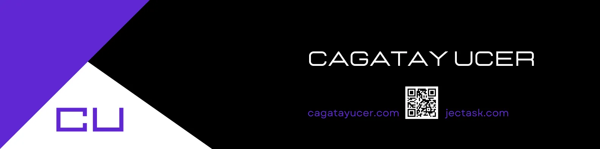

<h1 align="center">Hi 👋, I'm Cagatay</h1>
<h3 align="center">A passionate full-stack developer from Turkey</h3>

<!-- 
  
 -->

- 🌱 I’m currently working on **Google Cloud Platform**

<!-- - 👨‍💻 Checkout my portfolio at [cagatayucer.com](https://cagatayucer.com) -->

 

## 🛠 Skills

Javascript, Typescript, React, NextJS, Redux, Node, Express, MongoDB, Oracle, Google Cloud Platform ...

    
     
     
    
    
    
    
      
     
     
     
          
     
         
     
      

 

    

 

## 🔗 My Own Product

## 🌟 What is Jectask?

Jectask is a non-profit application and is completely free. Jectask brings all your ideas, projects and tasks together easily. You can turn every idea into a success project! It helps you plan your projects, track tasks efficiently wherever you are. Try [Jectask](https://www.jectask.com) for free now!

**Key Features:**

- **No-Ads**
- **Multi-Language App**
- **Fullscreen mode**
- **User-Friendly Dashboard**
- **Drag&Drop Boards**
- **Cross-platform support**
- **Tasks**
- **Notes**
- **Calendar**
- **Contacts**
- **Help Center**

 

    

<i>Click on the image to learn how to get started with Jectask in 5 minutes.</i>

## 🚀 Quick Start

### Try Jectask for [**free**](https://www.jectask.com/sign-up)

No installation required!

<table>
    <tr>
        <td></td>
        <td></td>
    </tr>
    <tr>
        <td></td>
        <td></td>
    </tr>
</table>

 
 

